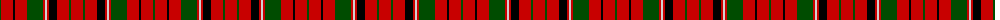

The parent of this is [MacNicol](/tartans/g/2/r12/k2/r12/g16/r2/n2/r2/k8/r12/g2/r/12/)

This was sourced from weddslist.  It is a [12 stripes tartan](/stripes/stripes12/).

Original link http://www.weddslist.com/cgi-bin/tartans/pg.pl?source=rb

## Thread count
G/2 R12 K2 R12 G16 R2 N2 R2 K8 R12 G2 R/12

## Palette
Each colour and its ΔE from the base-6 reference it is a variant of.

| Colour | Shade | Base | ΔE (OKLab) |
|---|---|---|---|
| G |  `#004C00` | G  | 0.08 |
| K |  `#000000` | K  | 0.00 |
| N |  `#D0D0D0` | W  | 0.11 |
| R |  `#C80000` | R  | 0.00 |

ID: /variants/g/2/r12/k2/r12/g16/r2/n2/r2/k8/r12/g2/r/12-g004c00-k000000-nd0d0d0-rc80000/
