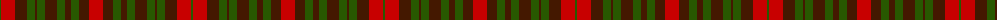

The parent of this is [Buchanan Variation (Fashion)](/tartans/g/2/r14/dr2/dr8/dr2/g8/dr2/g8/dr2/dr8/dr2/ga8/dr6/ga8/dr2/dr6/dr2/r/14/)

This was sourced from tartans-authority.  It is a [18 stripes tartan](/stripes/stripes18/).

Original link http://www.tartansauthority.com/tartan-ferret/display/3758/

## Thread count
G/2 R14 DR2 DR8 DR2 G8 DR2 G8 DR2 DR8 DR2 Ga8 DR6 Ga8 DR2 DR6 DR2 R/14

## Palette
Each colour and its ΔE from the base-6 reference it is a variant of.

| Colour | Shade | Base | ΔE (OKLab) |
|---|---|---|---|
| DR |  `#441800` | B  | 0.22 |
| G |  `#285800` | G  | 0.04 |
| Ga |  `#285800` | G  | 0.04 |
| R |  `#C80000` | R  | 0.00 |

ID: /variants/g/2/r14/dr2/dr8/dr2/g8/dr2/g8/dr2/dr8/dr2/ga8/dr6/ga8/dr2/dr6/dr2/r/14-dr441800-g285800-ga285800-rc80000/
