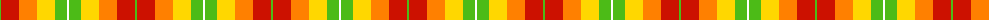
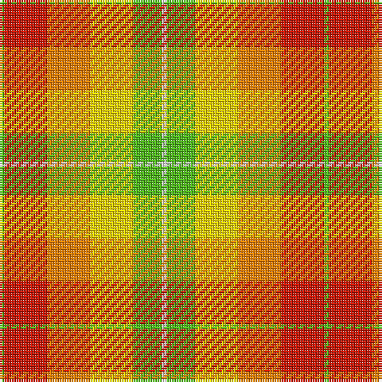

The parent of this is [Max Reger, The](/tartans/g/2/r18/o18/y18/g12/w/2/)

This was sourced from register-of-tartans.  It is a [6 stripes tartan](/stripes/stripes6/).

Original link https://www.tartanregister.gov.uk/tartanDetails.aspx?ref=10237

## Thread count
G/2 R18 O18 Y18 G12 W/2

## Palette
Each colour and its ΔE from the base-6 reference it is a variant of.

| Colour | Shade | Base | ΔE (OKLab) |
|---|---|---|---|
| G |  `#4CBB17` | Y  | 0.19 |
| O |  `#FF8000` | Y  | 0.15 |
| R |  `#CC1100` | R  | 0.01 |
| W |  `#FFFFFF` | W  | 0.03 |
| Y |  `#FFD700` | Y  | 0.07 |

# Sample pattern

ID: /variants/g/2/r18/o18/y18/g12/w/2-g4cbb17-off8000-rcc1100-wffffff-yffd700/
