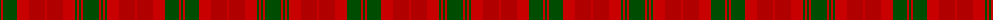

The parent of this is [MacNab](/tartans/g/2/r2/g14/r12/dr16/r2/dr16/r12/g2/r2/g2/r2/g/16/)

This was sourced from weddslist.  It is a [13 stripes tartan](/stripes/stripes13/).

Original link http://www.weddslist.com/cgi-bin/tartans/pg.pl?source=rb

## Thread count
G/2 R2 G14 R12 DR16 R2 DR16 R12 G2 R2 G2 R2 G/16

## Palette
Each colour and its ΔE from the base-6 reference it is a variant of.

| Colour | Shade | Base | ΔE (OKLab) |
|---|---|---|---|
| DR |  `#B00000` | R  | 0.05 |
| G |  `#004C00` | G  | 0.08 |
| R |  `#C80000` | R  | 0.00 |

ID: /variants/g/2/r2/g14/r12/dr16/r2/dr16/r12/g2/r2/g2/r2/g/16-drb00000-g004c00-rc80000/
