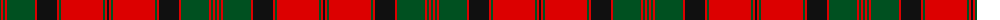

The parent of this is [MacQuarrie #4](/tartans/g/2/r2/g2/r2/g28/r2/k20/r2/g2/r42/g2/r2/k/2/)

This was sourced from register-of-tartans.  It is a [13 stripes tartan](/stripes/stripes13/).

Original link https://www.tartanregister.gov.uk/tartanDetails.aspx?ref=2731

## Thread count
G/2 R2 G2 R2 G28 R2 K20 R2 G2 R42 G2 R2 K/2

## Palette
Each colour and its ΔE from the base-6 reference it is a variant of.

| Colour | Shade | Base | ΔE (OKLab) |
|---|---|---|---|
| G |  `#005020` | G  | 0.08 |
| K |  `#101010` | K  | 0.17 |
| R |  `#DC0000` | R  | 0.04 |

ID: /variants/g/2/r2/g2/r2/g28/r2/k20/r2/g2/r42/g2/r2/k/2-g005020-k101010-rdc0000/
