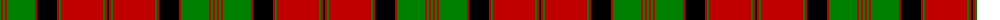

The parent of this is [MacQuarrie 6](/tartans/g/2/r2/g2/r2/g28/r2/k20/r2/g2/r42/g2/r2/k/2/)

This was sourced from weddslist.  It is a [13 stripes tartan](/stripes/stripes13/).

Original link http://www.weddslist.com/cgi-bin/tartans/pg.pl?source=sts

## Thread count
G/2 R2 G2 R2 G28 R2 K20 R2 G2 R42 G2 R2 K/2

## Palette
Each colour and its ΔE from the base-6 reference it is a variant of.

| Colour | Shade | Base | ΔE (OKLab) |
|---|---|---|---|
| G |  `#008000` | G  | 0.09 |
| K |  `#000000` | K  | 0.00 |
| R |  `#C00000` | R  | 0.02 |

ID: /variants/g/2/r2/g2/r2/g28/r2/k20/r2/g2/r42/g2/r2/k/2-g008000-k000000-rc00000/
