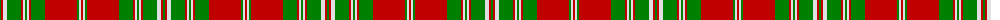

The parent of this is [Mordente](/tartans/g/2/r2/ln4/g14/r2/ln2/g2/ln2/r2/g14/r32/g2/ln2/r/2/)

This was sourced from weddslist.  It is a [14 stripes tartan](/stripes/stripes14/).

Original link http://www.weddslist.com/cgi-bin/tartans/pg.pl?source=sts

## Thread count
G/2 R2 LN4 G14 R2 LN2 G2 LN2 R2 G14 R32 G2 LN2 R/2

## Palette
Each colour and its ΔE from the base-6 reference it is a variant of.

| Colour | Shade | Base | ΔE (OKLab) |
|---|---|---|---|
| G |  `#008000` | G  | 0.09 |
| LN |  `#E0E0E0` | W  | 0.06 |
| R |  `#C00000` | R  | 0.02 |

ID: /variants/g/2/r2/ln4/g14/r2/ln2/g2/ln2/r2/g14/r32/g2/ln2/r/2-g008000-lne0e0e0-rc00000/
