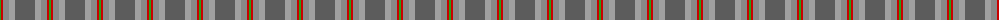
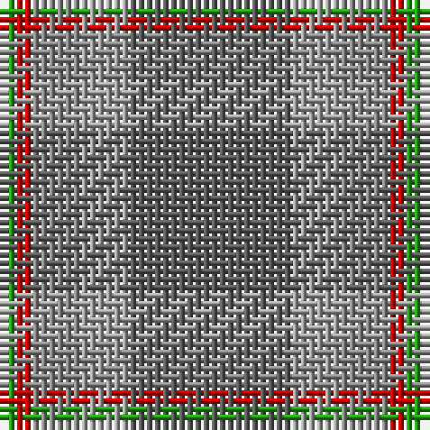

The parent of this is [Bagpipe Shop, The (Corporate)](/tartans/g/2/r2/nb6/na6/n/20/)

This was sourced from tartans-authority.  It is a [5 stripes tartan](/stripes/stripes5/).

Original link http://www.tartansauthority.com/tartan-ferret/display/10193/

## Thread count
G/2 R2 Nb6 Na6 N/20

## Palette
Each colour and its ΔE from the base-6 reference it is a variant of.

| Colour | Shade | Base | ΔE (OKLab) |
|---|---|---|---|
| G |  `#289C18` | G  | 0.18 |
| N |  `#5C5C5C` | B  | 0.14 |
| Na |  `#A0A0A0` | Y  | 0.20 |
| Nb |  `#888888` | R  | 0.24 |
| R |  `#C80000` | R  | 0.00 |

# Sample pattern

ID: /variants/g/2/r2/nb6/na6/n/20-g289c18-n5c5c5c-naa0a0a0-nb888888-rc80000/
