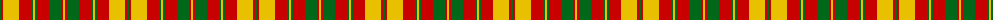

The parent of this is [Strathearn (Royal)](/tartans/g/2/r2/y16/r12/g2/y2/g2/r12/g12/r2/y/2/)

This was sourced from tartans-authority.  It is a [11 stripes tartan](/stripes/stripes11/).

Original link http://www.tartansauthority.com/tartan-ferret/display/1890/

## Thread count
G/2 R2 Y16 R12 G2 Y2 G2 R12 G12 R2 Y/2

## Palette
Each colour and its ΔE from the base-6 reference it is a variant of.

| Colour | Shade | Base | ΔE (OKLab) |
|---|---|---|---|
| G |  `#006818` | G  | 0.02 |
| R |  `#C80000` | R  | 0.00 |
| Y |  `#E8C000` | Y  | 0.00 |

ID: /variants/g/2/r2/y16/r12/g2/y2/g2/r12/g12/r2/y/2-g006818-rc80000-ye8c000/
