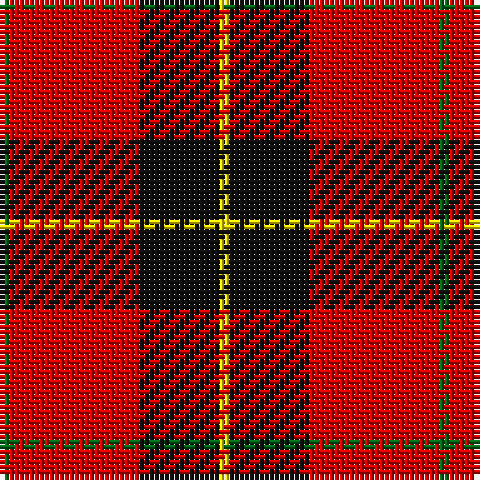

The parent of this is [Billy Apple® Red](/tartans/g/2/r26/k16/y/2/)

This was sourced from register-of-tartans.  It is a [4 stripes tartan](/stripes/stripes4/).

Original link https://www.tartanregister.gov.uk/tartanDetails.aspx?ref=11143

## Thread count
G/2 R26 K16 Y/2

## Palette
Each colour and its ΔE from the base-6 reference it is a variant of.

| Colour | Shade | Base | ΔE (OKLab) |
|---|---|---|---|
| G |  `#006818` | G  | 0.02 |
| K |  `#101010` | K  | 0.17 |
| R |  `#DC0000` | R  | 0.04 |
| Y |  `#FFE600` | Y  | 0.10 |

# Sample pattern

ID: /variants/g/2/r26/k16/y/2-g006818-k101010-rdc0000-yffe600/
