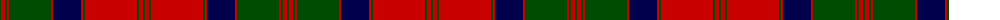

The parent of this is [MacQuarrie 1815](/tartans/g/2/r4/g2/r2/g42/r2/db28/r2/g2/r52/g2/r4/g/2/)

This was sourced from weddslist.  It is a [13 stripes tartan](/stripes/stripes13/).

Original link http://www.weddslist.com/cgi-bin/tartans/pg.pl?source=rb

## Thread count
G/2 R4 G2 R2 G42 R2 DB28 R2 G2 R52 G2 R4 G/2

## Palette
Each colour and its ΔE from the base-6 reference it is a variant of.

| Colour | Shade | Base | ΔE (OKLab) |
|---|---|---|---|
| DB |  `#00004C` | B  | 0.21 |
| G |  `#004C00` | G  | 0.08 |
| R |  `#C80000` | R  | 0.00 |

ID: /variants/g/2/r4/g2/r2/g42/r2/db28/r2/g2/r52/g2/r4/g/2-db00004c-g004c00-rc80000/
