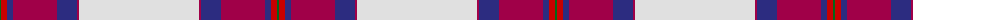

The parent of this is [Aviemore Dress Tartan Tartan Number: 8177. Earliest known date: Threadcount and colours aren't 100% original. Generated manually. See products available Copyright © Blair Urquhart, Comrie, 2015](/tartans/g/2/ra6/db6/r44/db20/r2/ln/120/)

This was sourced from house-of-tartan.  It is a [7 stripes tartan](/stripes/stripes7/).

Original link http://www.house-of-tartan.scotland.net/house/TartanViewjs.asp?colr=Def&tnam=8177

## Thread count
G/2 Ra6 DB6 R44 DB20 R2 LN/120

## Palette
Each colour and its ΔE from the base-6 reference it is a variant of.

| Colour | Shade | Base | ΔE (OKLab) |
|---|---|---|---|
| DB |  `#2C2C80` | B  | 0.05 |
| G |  `#006818` | G  | 0.02 |
| LN |  `#E0E0E0` | W  | 0.06 |
| R |  `#A00048` | R  | 0.11 |
| Ra |  `#C80000` | R  | 0.00 |

# Sample pattern

ID: /variants/g/2/ra6/db6/r44/db20/r2/ln/120-db2c2c80-g006818-lne0e0e0-ra00048-rac80000/
