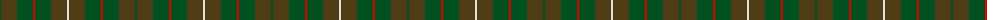
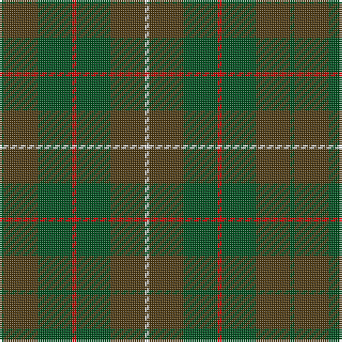

The parent of this is [MacKinnon Hunting](/tartans/g/2/t16/g16/r2/g16/t16/ln/2/)

This was sourced from register-of-tartans.  It is a [7 stripes tartan](/stripes/stripes7/).

Original link https://www.tartanregister.gov.uk/tartanDetails.aspx?ref=2555

## Thread count
G/2 T16 G16 R2 G16 T16 LN/2

## Palette
Each colour and its ΔE from the base-6 reference it is a variant of.

| Colour | Shade | Base | ΔE (OKLab) |
|---|---|---|---|
| G |  `#005020` | G  | 0.08 |
| LN |  `#E0E0E0` | W  | 0.06 |
| R |  `#DC0000` | R  | 0.04 |
| T |  `#503C14` | G  | 0.15 |

# Sample pattern

ID: /variants/g/2/t16/g16/r2/g16/t16/ln/2-g005020-lne0e0e0-rdc0000-t503c14/
