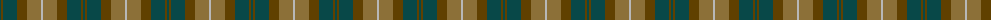
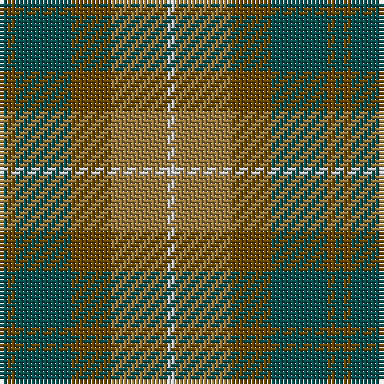

The parent of this is [Dewar (Fashion)](/tartans/g/2/t2/g14/t10/lt14/n/2/)

This was sourced from tartans-authority.  It is a [6 stripes tartan](/stripes/stripes6/).

Original link http://www.tartansauthority.com/tartan-ferret/display/4675/

## Thread count
G/2 T2 G14 T10 LT14 N/2

## Palette
Each colour and its ΔE from the base-6 reference it is a variant of.

| Colour | Shade | Base | ΔE (OKLab) |
|---|---|---|---|
| G |  `#084848` | B  | 0.12 |
| LT |  `#8C7038` | G  | 0.18 |
| N |  `#B8B8B8` | Y  | 0.17 |
| T |  `#604000` | G  | 0.14 |

# Sample pattern

ID: /variants/g/2/t2/g14/t10/lt14/n/2-g084848-lt8c7038-nb8b8b8-t604000/
