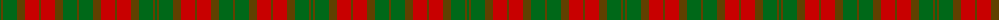

The parent of this is [Dewar](/tartans/g/2/t2/g14/t8/r14/t2/r14/t8/g14/t/2/)

This was sourced from register-of-tartans.  It is a [10 stripes tartan](/stripes/stripes10/).

Original link https://www.tartanregister.gov.uk/tartanDetails.aspx?ref=924

## Thread count
G/2 T2 G14 T8 R14 T2 R14 T8 G14 T/2

## Palette
Each colour and its ΔE from the base-6 reference it is a variant of.

| Colour | Shade | Base | ΔE (OKLab) |
|---|---|---|---|
| G |  `#006818` | G  | 0.02 |
| R |  `#C80000` | R  | 0.00 |
| T |  `#604000` | G  | 0.14 |

ID: /variants/g/2/t2/g14/t8/r14/t2/r14/t8/g14/t/2-g006818-rc80000-t604000/
