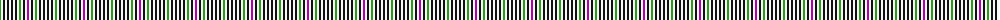

The parent of this is [Halliday (Name)](/tartans/g/2/w2/k2/w2/k2/w2/k2/w2/k2/w2/g2/w2/k2/w2/p/2/)

This was sourced from tartans-authority.  It is a [15 stripes tartan](/stripes/stripes15/).

Original link http://www.tartansauthority.com/tartan-ferret/display/7552/

## Thread count
G/2 W2 K2 W2 K2 W2 K2 W2 K2 W2 G2 W2 K2 W2 P/2

## Palette
Each colour and its ΔE from the base-6 reference it is a variant of.

| Colour | Shade | Base | ΔE (OKLab) |
|---|---|---|---|
| G |  `#289C18` | G  | 0.18 |
| K |  `#101010` | K  | 0.17 |
| P |  `#B000B0` | R  | 0.23 |
| W |  `#F8F8F8` | W  | 0.01 |

ID: /variants/g/2/w2/k2/w2/k2/w2/k2/w2/k2/w2/g2/w2/k2/w2/p/2-g289c18-k101010-pb000b0-wf8f8f8/
