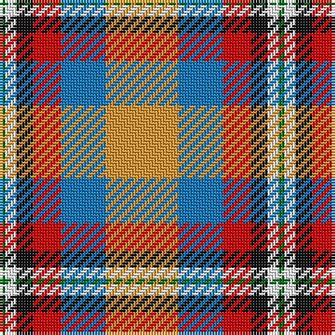

The parent of this is [Ball](/tartans/g/2/w4/k6/r10/b16/o/26/)

This was sourced from register-of-tartans.  It is a [6 stripes tartan](/stripes/stripes6/).

Original link https://www.tartanregister.gov.uk/tartanDetails.aspx?ref=175

## Thread count
G/2 W4 K6 R10 B16 O/26

## Palette
Each colour and its ΔE from the base-6 reference it is a variant of.

| Colour | Shade | Base | ΔE (OKLab) |
|---|---|---|---|
| B |  `#1474B4` | B  | 0.15 |
| DB |  `#2C2C80` | B  | 0.05 |
| G |  `#006818` | G  | 0.02 |
| K |  `#101010` | K  | 0.17 |
| LR |  `#E87878` | R  | 0.19 |
| O |  `#DC943C` | Y  | 0.12 |
| R |  `#C80000` | R  | 0.00 |
| W |  `#FCFCFC` | W  | 0.03 |
| Y |  `#E8C000` | Y  | 0.00 |

# Sample pattern

ID: /variants/g/2/w4/k6/r10/b16/o/26-b1474b4-db2c2c80-g006818-k101010-lre87878-odc943c-rc80000-wfcfcfc-ye8c000/
