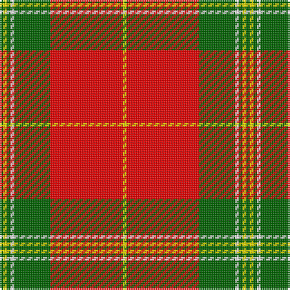

The parent of this is [Maver (Buckie)](/tartans/g/2/y2/g2/w2/g20/r40/y/2/)

This was sourced from register-of-tartans.  It is a [7 stripes tartan](/stripes/stripes7/).

Original link https://www.tartanregister.gov.uk/tartanDetails.aspx?ref=10329

## Thread count
G/2 Y2 G2 W2 G20 R40 Y/2

## Palette
Each colour and its ΔE from the base-6 reference it is a variant of.

| Colour | Shade | Base | ΔE (OKLab) |
|---|---|---|---|
| G |  `#006400` | G  | 0.00 |
| R |  `#FF0000` | R  | 0.11 |
| W |  `#FFFFFF` | W  | 0.03 |
| Y |  `#FFE600` | Y  | 0.10 |

# Sample pattern

ID: /variants/g/2/y2/g2/w2/g20/r40/y/2-g006400-rff0000-wffffff-yffe600/
