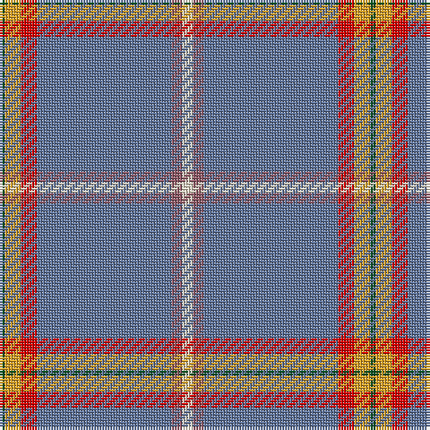

The parent of this is [Pool, Robert David (Personal)](/tartans/g/2/y6/r6/b50/lt4/w/4/)

This was sourced from register-of-tartans.  It is a [6 stripes tartan](/stripes/stripes6/).

Original link https://www.tartanregister.gov.uk/tartanDetails.aspx?ref=11486

## Thread count
G/2 Y6 R6 B50 LT4 W/4

## Palette
Each colour and its ΔE from the base-6 reference it is a variant of.

| Colour | Shade | Base | ΔE (OKLab) |
|---|---|---|---|
| B |  `#5F749C` | B  | 0.17 |
| G |  `#005020` | G  | 0.08 |
| LT |  `#905966` | R  | 0.15 |
| R |  `#DC0000` | R  | 0.04 |
| W |  `#F0E0C8` | W  | 0.06 |
| Y |  `#E0A126` | Y  | 0.08 |

# Sample pattern

ID: /variants/g/2/y6/r6/b50/lt4/w/4-b5f749c-g005020-lt905966-rdc0000-wf0e0c8-ye0a126/
