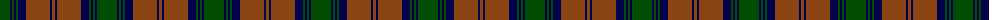

The parent of this is [Lindsay](/tartans/g/20/db2/g2/db2/g2/db8/t24/db2/t/3/)

This was sourced from weddslist.  It is a [9 stripes tartan](/stripes/stripes9/).

Original link http://www.weddslist.com/cgi-bin/tartans/pg.pl?source=rb

## Thread count
G/20 DB2 G2 DB2 G2 DB8 T24 DB2 T/3

## Palette
Each colour and its ΔE from the base-6 reference it is a variant of.

| Colour | Shade | Base | ΔE (OKLab) |
|---|---|---|---|
| DB |  `#00004C` | B  | 0.21 |
| G |  `#004C00` | G  | 0.08 |
| T |  `#8B4513` | R  | 0.13 |

ID: /variants/g/20/db2/g2/db2/g2/db8/t24/db2/t/3-db00004c-g004c00-t8b4513/
