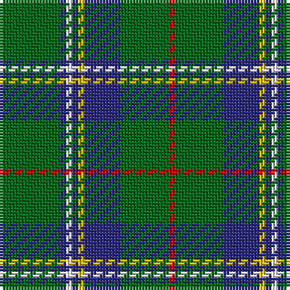

The parent of this is [Marshall Field (Corporate)](/tartans/g/20/db2/w2/db2/y2/db12/g16/r/2/)

This was sourced from tartans-authority.  It is a [8 stripes tartan](/stripes/stripes8/).

Original link http://www.tartansauthority.com/tartan-ferret/display/747/

## Thread count
G/20 DB2 W2 DB2 Y2 DB12 G16 R/2

## Palette
Each colour and its ΔE from the base-6 reference it is a variant of.

| Colour | Shade | Base | ΔE (OKLab) |
|---|---|---|---|
| DB |  `#2C2C80` | B  | 0.05 |
| G |  `#006818` | G  | 0.02 |
| R |  `#C80000` | R  | 0.00 |
| W |  `#FCFCFC` | W  | 0.03 |
| Y |  `#E8C000` | Y  | 0.00 |

# Sample pattern

ID: /variants/g/20/db2/w2/db2/y2/db12/g16/r/2-db2c2c80-g006818-rc80000-wfcfcfc-ye8c000/
