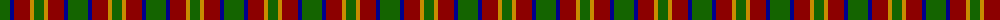
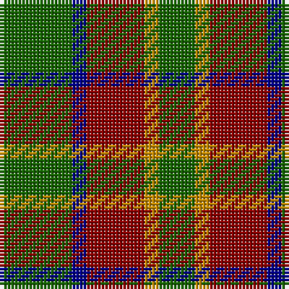

The parent of this is [Cub Scouts of America (Corporate)](/tartans/g/20/db4/dr16/dy4/g/10/)

This was sourced from tartans-authority.  It is a [5 stripes tartan](/stripes/stripes5/).

Original link http://www.tartansauthority.com/tartan-ferret/display/4119/

## Thread count
G/20 DB4 DR16 DY4 G/10

## Palette
Each colour and its ΔE from the base-6 reference it is a variant of.

| Colour | Shade | Base | ΔE (OKLab) |
|---|---|---|---|
| DB |  `#00008C` | B  | 0.13 |
| DR |  `#8C0000` | R  | 0.13 |
| DY |  `#C88C00` | Y  | 0.15 |
| G |  `#146400` | G  | 0.01 |

# Sample pattern

ID: /variants/g/20/db4/dr16/dy4/g/10-db00008c-dr8c0000-dyc88c00-g146400/
