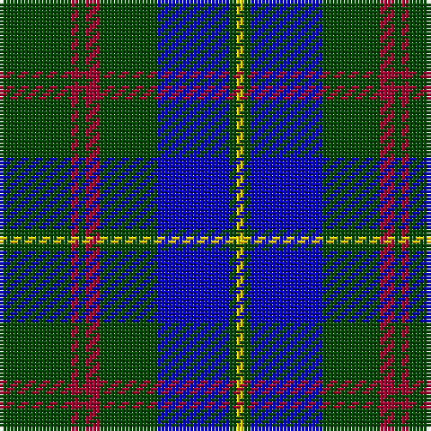

The parent of this is [Glen Esk (Fashion)](/tartans/g/20/dr2/g2/dr4/g16/b20/g2/y/2/)

This was sourced from tartans-authority.  It is a [8 stripes tartan](/stripes/stripes8/).

Original link http://www.tartansauthority.com/tartan-ferret/display/5006/

## Thread count
G/20 DR2 G2 DR4 G16 B20 G2 Y/2

## Palette
Each colour and its ΔE from the base-6 reference it is a variant of.

| Colour | Shade | Base | ΔE (OKLab) |
|---|---|---|---|
| B |  `#0000B4` | B  | 0.13 |
| DR |  `#9C0030` | R  | 0.10 |
| G |  `#004800` | G  | 0.09 |
| Y |  `#FCC800` | Y  | 0.04 |

# Sample pattern

ID: /variants/g/20/dr2/g2/dr4/g16/b20/g2/y/2-b0000b4-dr9c0030-g004800-yfcc800/
