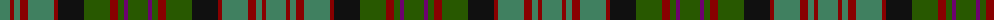

The parent of this is [MacDonald of Denovan Htg (Clan)](/tartans/g/20/dr4/g6/dr8/g26/dr4/k26/ga26/dr8/ga6/p4/ga/20/)

This was sourced from tartans-authority.  It is a [12 stripes tartan](/stripes/stripes12/).

Original link http://www.tartansauthority.com/tartan-ferret/display/3278/

## Thread count
G/20 DR4 G6 DR8 G26 DR4 K26 Ga26 DR8 Ga6 P4 Ga/20

## Palette
Each colour and its ΔE from the base-6 reference it is a variant of.

| Colour | Shade | Base | ΔE (OKLab) |
|---|---|---|---|
| DR |  `#880000` | R  | 0.14 |
| G |  `#408060` | G  | 0.13 |
| Ga |  `#285800` | G  | 0.04 |
| K |  `#101010` | K  | 0.17 |
| P |  `#6C0070` | B  | 0.15 |

ID: /variants/g/20/dr4/g6/dr8/g26/dr4/k26/ga26/dr8/ga6/p4/ga/20-dr880000-g408060-ga285800-k101010-p6c0070/
