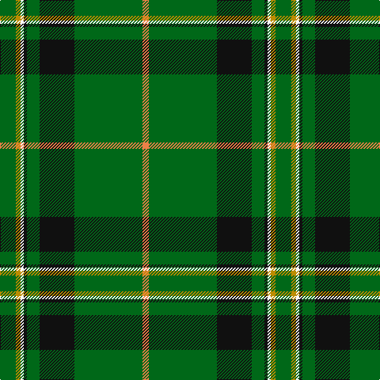

The parent of this is [Celtic Pride (Fashion)](/tartans/g/20/dy6/w4/k4/g16/k44/g86/o/8/)

This was sourced from tartans-authority.  It is a [8 stripes tartan](/stripes/stripes8/).

Original link http://www.tartansauthority.com/tartan-ferret/display/6267/

## Thread count
G/20 DY6 W4 K4 G16 K44 G86 O/8

## Palette
Each colour and its ΔE from the base-6 reference it is a variant of.

| Colour | Shade | Base | ΔE (OKLab) |
|---|---|---|---|
| DY |  `#BC8C00` | Y  | 0.16 |
| G |  `#006818` | G  | 0.02 |
| K |  `#101010` | K  | 0.17 |
| O |  `#EC8048` | Y  | 0.17 |
| W |  `#FCFCFC` | W  | 0.03 |

# Sample pattern

ID: /variants/g/20/dy6/w4/k4/g16/k44/g86/o/8-dybc8c00-g006818-k101010-oec8048-wfcfcfc/
