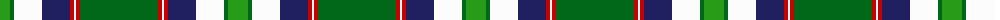

The parent of this is [Southwell (Australian) (Personal)](/tartans/g/20/ga4/w28/db28/r4/w2/r4/ga/78/)

This was sourced from tartans-authority.  It is a [8 stripes tartan](/stripes/stripes8/).

Original link http://www.tartansauthority.com/tartan-ferret/display/6744/

## Thread count
G/20 Ga4 W28 DB28 R4 W2 R4 Ga/78

## Palette
Each colour and its ΔE from the base-6 reference it is a variant of.

| Colour | Shade | Base | ΔE (OKLab) |
|---|---|---|---|
| DB |  `#202060` | B  | 0.11 |
| G |  `#289C18` | G  | 0.18 |
| Ga |  `#006818` | G  | 0.02 |
| R |  `#C80000` | R  | 0.00 |
| W |  `#FCFCFC` | W  | 0.03 |

# Sample pattern

ID: /variants/g/20/ga4/w28/db28/r4/w2/r4/ga/78-db202060-g289c18-ga006818-rc80000-wfcfcfc/
