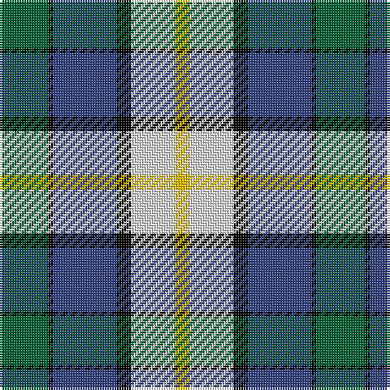

The parent of this is [Inverary](/tartans/g/20/k2/b26/k6/ln18/y/6/)

This was sourced from weddslist.  It is a [6 stripes tartan](/stripes/stripes6/).

Original link http://www.weddslist.com/cgi-bin/tartans/pg.pl?source=sts

## Thread count
G/20 K2 B26 K6 LN18 Y/6

## Palette
Each colour and its ΔE from the base-6 reference it is a variant of.

| Colour | Shade | Base | ΔE (OKLab) |
|---|---|---|---|
| B |  `#304080` | B  | 0.01 |
| G |  `#006030` | G  | 0.04 |
| K |  `#000000` | K  | 0.00 |
| LN |  `#E0E0E0` | W  | 0.06 |
| Y |  `#F0C000` | Y  | 0.01 |

# Sample pattern

ID: /variants/g/20/k2/b26/k6/ln18/y/6-b304080-g006030-k000000-lne0e0e0-yf0c000/
