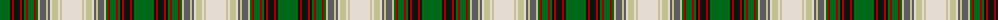

The parent of this is [Spice of Life (Fashion)](/tartans/g/20/k2/dr2/k6/dr2/k2/g2/dr2/g6/dr2/g2/na2/n6/na2/n2/w2/na6/w2/na2/w/20/)

This was sourced from tartans-authority.  It is a [20 stripes tartan](/stripes/stripes20/).

Original link http://www.tartansauthority.com/tartan-ferret/display/10165/

## Thread count
G/20 K2 DR2 K6 DR2 K2 G2 DR2 G6 DR2 G2 Na2 N6 Na2 N2 W2 Na6 W2 Na2 W/20

## Palette
Each colour and its ΔE from the base-6 reference it is a variant of.

| Colour | Shade | Base | ΔE (OKLab) |
|---|---|---|---|
| DR |  `#A00000` | R  | 0.09 |
| G |  `#006818` | G  | 0.02 |
| K |  `#101010` | K  | 0.17 |
| N |  `#5C5C5C` | B  | 0.14 |
| Na |  `#C4C094` | Y  | 0.11 |
| W |  `#E4DCD0` | W  | 0.07 |

ID: /variants/g/20/k2/dr2/k6/dr2/k2/g2/dr2/g6/dr2/g2/na2/n6/na2/n2/w2/na6/w2/na2/w/20-dra00000-g006818-k101010-n5c5c5c-nac4c094-we4dcd0/
