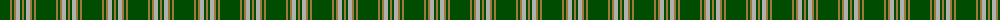
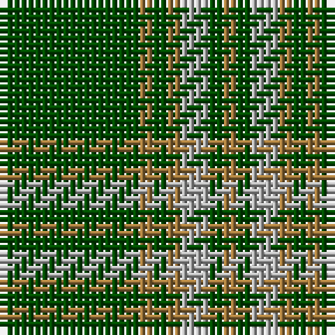

The parent of this is [Green Watch (Fashion)](/tartans/g/20/lt2/g2/lt2/n4/g2/lt/2/)

This was sourced from tartans-authority.  It is a [7 stripes tartan](/stripes/stripes7/).

Original link http://www.tartansauthority.com/tartan-ferret/display/5114/

## Thread count
G/20 LT2 G2 LT2 N4 G2 LT/2

## Palette
Each colour and its ΔE from the base-6 reference it is a variant of.

| Colour | Shade | Base | ΔE (OKLab) |
|---|---|---|---|
| G |  `#004C00` | G  | 0.08 |
| LT |  `#A0783C` | R  | 0.18 |
| N |  `#B0B0B0` | Y  | 0.18 |

# Sample pattern

ID: /variants/g/20/lt2/g2/lt2/n4/g2/lt/2-g004c00-lta0783c-nb0b0b0/
