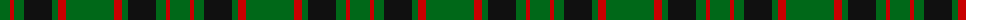
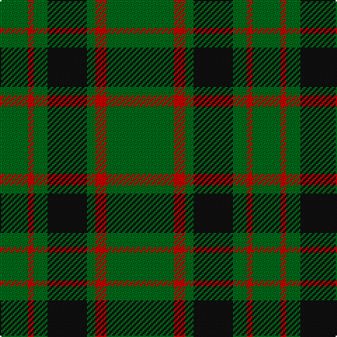

The parent of this is [Northcroft (Personal)](/tartans/g/20/r4/g10/k28/g6/r8/g/48/)

This was sourced from tartans-authority.  It is a [7 stripes tartan](/stripes/stripes7/).

Original link http://www.tartansauthority.com/tartan-ferret/display/2459/

## Thread count
G/20 R4 G10 K28 G6 R8 G/48

## Palette
Each colour and its ΔE from the base-6 reference it is a variant of.

| Colour | Shade | Base | ΔE (OKLab) |
|---|---|---|---|
| G |  `#006818` | G  | 0.02 |
| K |  `#101010` | K  | 0.17 |
| R |  `#C80000` | R  | 0.00 |

# Sample pattern

ID: /variants/g/20/r4/g10/k28/g6/r8/g/48-g006818-k101010-rc80000/
