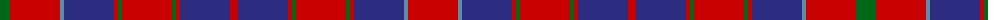

The parent of this is [Hebrides #4](/tartans/g/20/r50/b4/db50/r4/g4/r50/g4/r4/db50/r8/db50/r4/g4/r50/g4/r4/db50/b4/r/50/)

This was sourced from register-of-tartans.  It is a [20 stripes tartan](/stripes/stripes20/).

Original link https://www.tartanregister.gov.uk/tartanDetails.aspx?ref=1660

## Thread count
G/20 R50 B4 DB50 R4 G4 R50 G4 R4 DB50 R8 DB50 R4 G4 R50 G4 R4 DB50 B4 R/50

## Palette
Each colour and its ΔE from the base-6 reference it is a variant of.

| Colour | Shade | Base | ΔE (OKLab) |
|---|---|---|---|
| B |  `#5C8CA8` | B  | 0.23 |
| DB |  `#2C2C80` | B  | 0.05 |
| G |  `#006818` | G  | 0.02 |
| R |  `#C80000` | R  | 0.00 |

ID: /variants/g/20/r50/b4/db50/r4/g4/r50/g4/r4/db50/r8/db50/r4/g4/r50/g4/r4/db50/b4/r/50-b5c8ca8-db2c2c80-g006818-rc80000/
