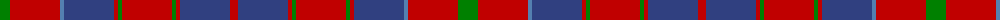

The parent of this is [Hebridean 3](/tartans/g/20/r50/ba4/b50/r4/g4/r50/g4/r4/b50/r/8/)

This was sourced from weddslist.  It is a [11 stripes tartan](/stripes/stripes11/).

Original link http://www.weddslist.com/cgi-bin/tartans/pg.pl?source=sts

## Thread count
G/20 R50 Ba4 B50 R4 G4 R50 G4 R4 B50 R/8

## Palette
Each colour and its ΔE from the base-6 reference it is a variant of.

| Colour | Shade | Base | ΔE (OKLab) |
|---|---|---|---|
| B |  `#304080` | B  | 0.01 |
| Ba |  `#5480B0` | B  | 0.20 |
| G |  `#008000` | G  | 0.09 |
| R |  `#C00000` | R  | 0.02 |

ID: /variants/g/20/r50/ba4/b50/r4/g4/r50/g4/r4/b50/r/8-b304080-ba5480b0-g008000-rc00000/
