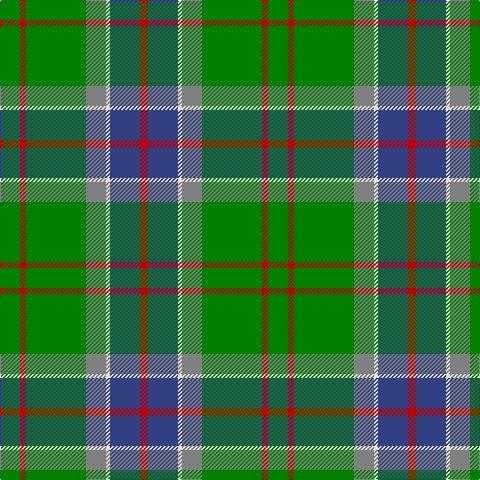

The parent of this is [Sinclair](/tartans/g/20/r6/g60/n20/ln4/b30/r/8/)

This was sourced from weddslist.  It is a [7 stripes tartan](/stripes/stripes7/).

Original link http://www.weddslist.com/cgi-bin/tartans/pg.pl?source=sts

## Thread count
G/20 R6 G60 N20 LN4 B30 R/8

## Palette
Each colour and its ΔE from the base-6 reference it is a variant of.

| Colour | Shade | Base | ΔE (OKLab) |
|---|---|---|---|
| B |  `#304080` | B  | 0.01 |
| G |  `#008000` | G  | 0.09 |
| LN |  `#E0E0E0` | W  | 0.06 |
| N |  `#808080` | G  | 0.22 |
| R |  `#C00000` | R  | 0.02 |

# Sample pattern

ID: /variants/g/20/r6/g60/n20/ln4/b30/r/8-b304080-g008000-lne0e0e0-n808080-rc00000/
