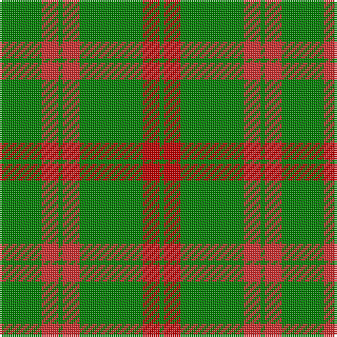

The parent of this is [Logan](/tartans/g/20/r8/g2/r8/g30/ra8/g/2/)

This was sourced from weddslist.  It is a [7 stripes tartan](/stripes/stripes7/).

Original link http://www.weddslist.com/cgi-bin/tartans/pg.pl?source=sts

## Thread count
G/20 R8 G2 R8 G30 Ra8 G/2

## Palette
Each colour and its ΔE from the base-6 reference it is a variant of.

| Colour | Shade | Base | ΔE (OKLab) |
|---|---|---|---|
| G |  `#008000` | G  | 0.09 |
| R |  `#D03030` | R  | 0.05 |
| Ra |  `#C00000` | R  | 0.02 |

# Sample pattern

ID: /variants/g/20/r8/g2/r8/g30/ra8/g/2-g008000-rd03030-rac00000/
