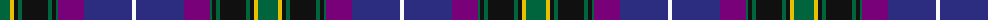

The parent of this is [Lang of Sherbrooke (Personal)](/tartans/g/20/y4/k4/g4/k26/g4/k4/g2/p26/db48/w/4/)

This was sourced from register-of-tartans.  It is a [11 stripes tartan](/stripes/stripes11/).

Original link https://www.tartanregister.gov.uk/tartanDetails.aspx?ref=2043

## Thread count
G/20 Y4 K4 G4 K26 G4 K4 G2 P26 DB48 W/4

## Palette
Each colour and its ΔE from the base-6 reference it is a variant of.

| Colour | Shade | Base | ΔE (OKLab) |
|---|---|---|---|
| DB |  `#2C2C80` | B  | 0.05 |
| G |  `#00643C` | G  | 0.06 |
| K |  `#101010` | K  | 0.17 |
| P |  `#780078` | B  | 0.16 |
| W |  `#FCFCFC` | W  | 0.03 |
| Y |  `#E8C000` | Y  | 0.00 |

ID: /variants/g/20/y4/k4/g4/k26/g4/k4/g2/p26/db48/w/4-db2c2c80-g00643c-k101010-p780078-wfcfcfc-ye8c000/
