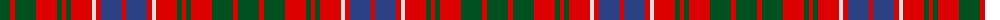

The parent of this is [MacRae (Sample)](/tartans/g/21/r5/g21/r21/g5/r4/g5/r21/ln4/r5/b21/r/4/)

This was sourced from register-of-tartans.  It is a [12 stripes tartan](/stripes/stripes12/).

Original link https://www.tartanregister.gov.uk/tartanDetails.aspx?ref=2743

## Thread count
G/21 R5 G21 R21 G5 R4 G5 R21 LN4 R5 B21 R/4

## Palette
Each colour and its ΔE from the base-6 reference it is a variant of.

| Colour | Shade | Base | ΔE (OKLab) |
|---|---|---|---|
| B |  `#2C4084` | B  | 0.00 |
| G |  `#005020` | G  | 0.08 |
| LN |  `#E0E0E0` | W  | 0.06 |
| R |  `#DC0000` | R  | 0.04 |

ID: /variants/g/21/r5/g21/r21/g5/r4/g5/r21/ln4/r5/b21/r/4-b2c4084-g005020-lne0e0e0-rdc0000/
