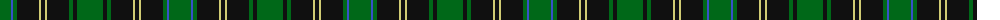

The parent of this is [Hopetoun (Corporate)](/tartans/g/22/b2/g4/k22/lg2/k4/lg2/k22/g4/k4/g/26/)

This was sourced from tartans-authority.  It is a [11 stripes tartan](/stripes/stripes11/).

Original link http://www.tartansauthority.com/tartan-ferret/display/722/

## Thread count
G/22 B2 G4 K22 LG2 K4 LG2 K22 G4 K4 G/26

## Palette
Each colour and its ΔE from the base-6 reference it is a variant of.

| Colour | Shade | Base | ΔE (OKLab) |
|---|---|---|---|
| B |  `#3850C8` | B  | 0.12 |
| G |  `#006818` | G  | 0.02 |
| K |  `#101010` | K  | 0.17 |
| LG |  `#D0CC74` | Y  | 0.07 |

ID: /variants/g/22/b2/g4/k22/lg2/k4/lg2/k22/g4/k4/g/26-b3850c8-g006818-k101010-lgd0cc74/
