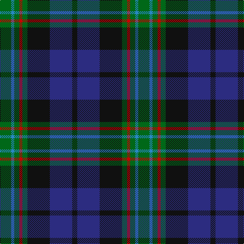

The parent of this is [Wood (Personal)](/tartans/g/22/b6/g10/r6/g10/k44/db44/k/10/)

This was sourced from tartans-authority.  It is a [8 stripes tartan](/stripes/stripes8/).

Original link http://www.tartansauthority.com/tartan-ferret/display/6589/

## Thread count
G/22 B6 G10 R6 G10 K44 DB44 K/10

## Palette
Each colour and its ΔE from the base-6 reference it is a variant of.

| Colour | Shade | Base | ΔE (OKLab) |
|---|---|---|---|
| B |  `#2888C4` | B  | 0.21 |
| DB |  `#2C2C80` | B  | 0.05 |
| G |  `#006818` | G  | 0.02 |
| K |  `#101010` | K  | 0.17 |
| R |  `#C80000` | R  | 0.00 |

# Sample pattern

ID: /variants/g/22/b6/g10/r6/g10/k44/db44/k/10-b2888c4-db2c2c80-g006818-k101010-rc80000/
