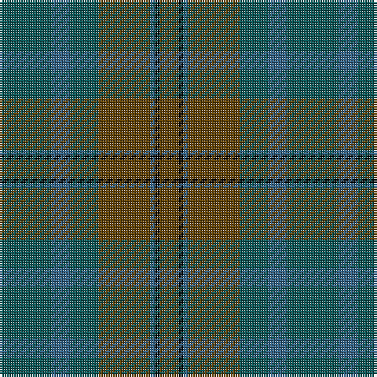

The parent of this is [Calais (Fashion)](/tartans/g/22/b8/g12/t22/b2/k2/t/8/)

This was sourced from tartans-authority.  It is a [7 stripes tartan](/stripes/stripes7/).

Original link http://www.tartansauthority.com/tartan-ferret/display/3779/

## Thread count
G/22 B8 G12 T22 B2 K2 T/8

## Palette
Each colour and its ΔE from the base-6 reference it is a variant of.

| Colour | Shade | Base | ΔE (OKLab) |
|---|---|---|---|
| B |  `#306084` | B  | 0.10 |
| G |  `#085454` | B  | 0.12 |
| K |  `#000000` | K  | 0.00 |
| T |  `#604000` | G  | 0.14 |

# Sample pattern

ID: /variants/g/22/b8/g12/t22/b2/k2/t/8-b306084-g085454-k000000-t604000/
