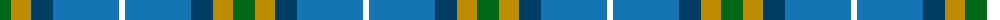
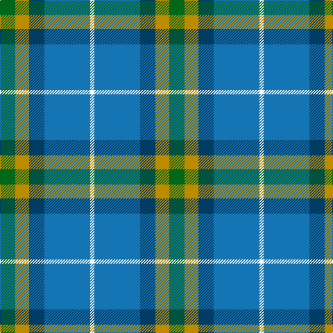

The parent of this is [Sterling (Name)](/tartans/g/22/dy20/db22/b66/w/6/)

This was sourced from tartans-authority.  It is a [5 stripes tartan](/stripes/stripes5/).

Original link http://www.tartansauthority.com/tartan-ferret/display/10653/

## Thread count
G/22 DY20 DB22 B66 W/6

## Palette
Each colour and its ΔE from the base-6 reference it is a variant of.

| Colour | Shade | Base | ΔE (OKLab) |
|---|---|---|---|
| B |  `#1474B4` | B  | 0.15 |
| DB |  `#003C64` | B  | 0.07 |
| DY |  `#BC8C00` | Y  | 0.16 |
| G |  `#006818` | G  | 0.02 |
| W |  `#FCFCFC` | W  | 0.03 |

# Sample pattern

ID: /variants/g/22/dy20/db22/b66/w/6-b1474b4-db003c64-dybc8c00-g006818-wfcfcfc/
