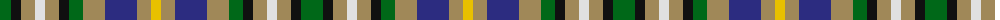

The parent of this is [Roscommon County Crest (Fashion)](/tartans/g/22/k10/lt14/ln10/lt14/k10/g14/lt22/db32/lt14/y/10/)

This was sourced from tartans-authority.  It is a [11 stripes tartan](/stripes/stripes11/).

Original link http://www.tartansauthority.com/tartan-ferret/display/7429/

## Thread count
G/22 K10 LT14 LN10 LT14 K10 G14 LT22 DB32 LT14 Y/10

## Palette
Each colour and its ΔE from the base-6 reference it is a variant of.

| Colour | Shade | Base | ΔE (OKLab) |
|---|---|---|---|
| DB |  `#2C2C80` | B  | 0.05 |
| G |  `#006818` | G  | 0.02 |
| K |  `#101010` | K  | 0.17 |
| LN |  `#E0E0E0` | W  | 0.06 |
| LT |  `#A08858` | Y  | 0.21 |
| Y |  `#E8C000` | Y  | 0.00 |

ID: /variants/g/22/k10/lt14/ln10/lt14/k10/g14/lt22/db32/lt14/y/10-db2c2c80-g006818-k101010-lne0e0e0-lta08858-ye8c000/
