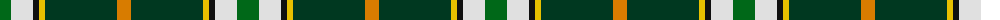

The parent of this is [Driver (Name)](/tartans/g/22/ln22/k6/y6/dg72/o/14/)

This was sourced from tartans-authority.  It is a [6 stripes tartan](/stripes/stripes6/).

Original link http://www.tartansauthority.com/tartan-ferret/display/10161/

## Thread count
G/22 LN22 K6 Y6 DG72 O/14

## Palette
Each colour and its ΔE from the base-6 reference it is a variant of.

| Colour | Shade | Base | ΔE (OKLab) |
|---|---|---|---|
| DG |  `#003820` | G  | 0.16 |
| G |  `#006818` | G  | 0.02 |
| K |  `#101010` | K  | 0.17 |
| LN |  `#E0E0E0` | W  | 0.06 |
| O |  `#D87C00` | Y  | 0.17 |
| Y |  `#E8C000` | Y  | 0.00 |

# Sample pattern

ID: /variants/g/22/ln22/k6/y6/dg72/o/14-dg003820-g006818-k101010-lne0e0e0-od87c00-ye8c000/
