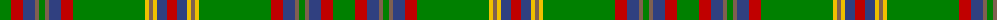

The parent of this is [Westmeath](/tartans/g/22/r12/b12/lt4/g6/lt4/b12/r12/g72/y4/lt4/y4/b10/r/10/)

This was sourced from weddslist.  It is a [14 stripes tartan](/stripes/stripes14/).

Original link http://www.weddslist.com/cgi-bin/tartans/pg.pl?source=sts

## Thread count
G/22 R12 B12 LT4 G6 LT4 B12 R12 G72 Y4 LT4 Y4 B10 R/10

## Palette
Each colour and its ΔE from the base-6 reference it is a variant of.

| Colour | Shade | Base | ΔE (OKLab) |
|---|---|---|---|
| B |  `#304080` | B  | 0.01 |
| G |  `#008000` | G  | 0.09 |
| LT |  `#806050` | R  | 0.17 |
| R |  `#C00000` | R  | 0.02 |
| Y |  `#F0C000` | Y  | 0.01 |

ID: /variants/g/22/r12/b12/lt4/g6/lt4/b12/r12/g72/y4/lt4/y4/b10/r/10-b304080-g008000-lt806050-rc00000-yf0c000/
