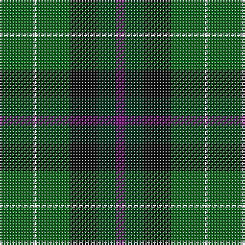

The parent of this is [Hibernian Football Club (Corporate)](/tartans/g/22/w2/g22/k18/dg12/p/6/)

This was sourced from tartans-authority.  It is a [6 stripes tartan](/stripes/stripes6/).

Original link http://www.tartansauthority.com/tartan-ferret/display/2559/

## Thread count
G/22 W2 G22 K18 DG12 P/6

## Palette
Each colour and its ΔE from the base-6 reference it is a variant of.

| Colour | Shade | Base | ΔE (OKLab) |
|---|---|---|---|
| DG |  `#003820` | G  | 0.16 |
| G |  `#006818` | G  | 0.02 |
| K |  `#101010` | K  | 0.17 |
| P |  `#780078` | B  | 0.16 |
| W |  `#FCFCFC` | W  | 0.03 |

# Sample pattern

ID: /variants/g/22/w2/g22/k18/dg12/p/6-dg003820-g006818-k101010-p780078-wfcfcfc/
