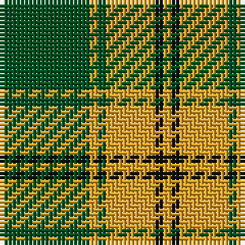

The parent of this is [Big Spruce Brewing](/tartans/g/22/y2/g2/y12/k2/y/2/)

This was sourced from register-of-tartans.  It is a [6 stripes tartan](/stripes/stripes6/).

Original link https://www.tartanregister.gov.uk/tartanDetails.aspx?ref=11025

## Thread count
G/22 Y2 G2 Y12 K2 Y/2

## Palette
Each colour and its ΔE from the base-6 reference it is a variant of.

| Colour | Shade | Base | ΔE (OKLab) |
|---|---|---|---|
| G |  `#005020` | G  | 0.08 |
| K |  `#101010` | K  | 0.17 |
| Y |  `#E0A126` | Y  | 0.08 |

# Sample pattern

ID: /variants/g/22/y2/g2/y12/k2/y/2-g005020-k101010-ye0a126/
