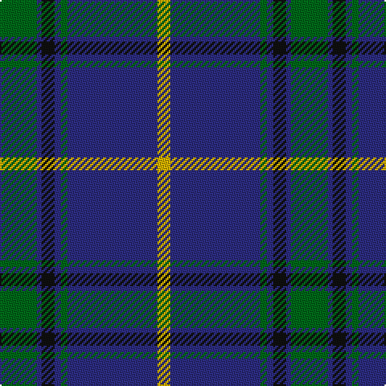

The parent of this is [Tern House](/tartans/g/23/db3/k8/db4/g4/db56/y/8/)

This was sourced from tartans-authority.  It is a [7 stripes tartan](/stripes/stripes7/).

Original link http://www.tartansauthority.com/tartan-ferret/display/11247/

## Thread count
G/23 DB3 K8 DB4 G4 DB56 Y/8

## Palette
Each colour and its ΔE from the base-6 reference it is a variant of.

| Colour | Shade | Base | ΔE (OKLab) |
|---|---|---|---|
| DB |  `#2C2C80` | B  | 0.05 |
| G |  `#006818` | G  | 0.02 |
| K |  `#101010` | K  | 0.17 |
| Y |  `#D8B000` | Y  | 0.05 |

# Sample pattern

ID: /variants/g/23/db3/k8/db4/g4/db56/y/8-db2c2c80-g006818-k101010-yd8b000/
