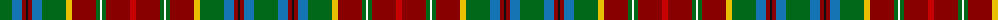

The parent of this is [Hyndman (Personal)](/tartans/g/24/b10/dr4/k2/dr4/b10/g24/y6/dr24/g4/w2/g4/dr24/r/6/)

This was sourced from tartans-authority.  It is a [14 stripes tartan](/stripes/stripes14/).

Original link http://www.tartansauthority.com/tartan-ferret/display/6128/

## Thread count
G/24 B10 DR4 K2 DR4 B10 G24 Y6 DR24 G4 W2 G4 DR24 R/6

## Palette
Each colour and its ΔE from the base-6 reference it is a variant of.

| Colour | Shade | Base | ΔE (OKLab) |
|---|---|---|---|
| B |  `#1474B4` | B  | 0.15 |
| DR |  `#880000` | R  | 0.14 |
| G |  `#006818` | G  | 0.02 |
| K |  `#101010` | K  | 0.17 |
| R |  `#C80000` | R  | 0.00 |
| W |  `#FCFCFC` | W  | 0.03 |
| Y |  `#E8C000` | Y  | 0.00 |

ID: /variants/g/24/b10/dr4/k2/dr4/b10/g24/y6/dr24/g4/w2/g4/dr24/r/6-b1474b4-dr880000-g006818-k101010-rc80000-wfcfcfc-ye8c000/
