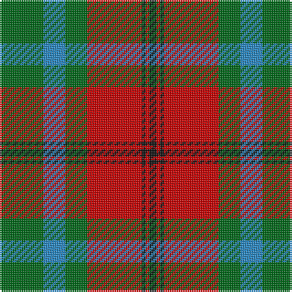

The parent of this is [McCook/Cook (Name)](/tartans/g/24/b12/g12/r30/k2/r2/k/4/)

This was sourced from tartans-authority.  It is a [7 stripes tartan](/stripes/stripes7/).

Original link http://www.tartansauthority.com/tartan-ferret/display/3910/

## Thread count
G/24 B12 G12 R30 K2 R2 K/4

## Palette
Each colour and its ΔE from the base-6 reference it is a variant of.

| Colour | Shade | Base | ΔE (OKLab) |
|---|---|---|---|
| B |  `#2888C4` | B  | 0.21 |
| G |  `#006818` | G  | 0.02 |
| K |  `#101010` | K  | 0.17 |
| R |  `#C80000` | R  | 0.00 |

# Sample pattern

ID: /variants/g/24/b12/g12/r30/k2/r2/k/4-b2888c4-g006818-k101010-rc80000/
