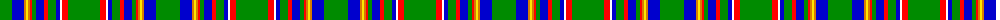

The parent of this is [Heneghan (Personal)](/tartans/g/24/b12/o2/y2/o2/r2/g4/b8/r4/g8/b4/w2/r6/g/32/)

This was sourced from register-of-tartans.  It is a [14 stripes tartan](/stripes/stripes14/).

Original link https://www.tartanregister.gov.uk/tartanDetails.aspx?ref=4969

## Thread count
G/24 B12 O2 Y2 O2 R2 G4 B8 R4 G8 B4 W2 R6 G/32

## Palette
Each colour and its ΔE from the base-6 reference it is a variant of.

| Colour | Shade | Base | ΔE (OKLab) |
|---|---|---|---|
| B |  `#0000CD` | B  | 0.15 |
| G |  `#008B00` | G  | 0.12 |
| O |  `#D87C00` | Y  | 0.17 |
| R |  `#FF0000` | R  | 0.11 |
| W |  `#FFFFFF` | W  | 0.03 |
| Y |  `#FFE600` | Y  | 0.10 |

ID: /variants/g/24/b12/o2/y2/o2/r2/g4/b8/r4/g8/b4/w2/r6/g/32-b0000cd-g008b00-od87c00-rff0000-wffffff-yffe600/
