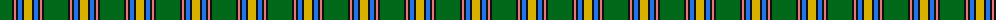
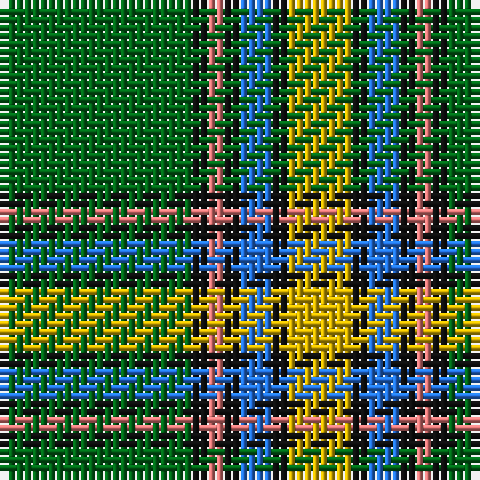

The parent of this is [Alberta (District)](/tartans/g/24/k2/lr2/k2/b4/k2/y/8/)

This was sourced from tartans-authority.  It is a [7 stripes tartan](/stripes/stripes7/).

Original link http://www.tartansauthority.com/tartan-ferret/display/2055/

## Thread count
G/24 K2 LR2 K2 B4 K2 Y/8

## Palette
Each colour and its ΔE from the base-6 reference it is a variant of.

| Colour | Shade | Base | ΔE (OKLab) |
|---|---|---|---|
| B |  `#2474E8` | B  | 0.20 |
| G |  `#006818` | G  | 0.02 |
| K |  `#101010` | K  | 0.17 |
| LR |  `#E87878` | R  | 0.19 |
| Y |  `#D8B000` | Y  | 0.05 |

# Sample pattern

ID: /variants/g/24/k2/lr2/k2/b4/k2/y/8-b2474e8-g006818-k101010-lre87878-yd8b000/
